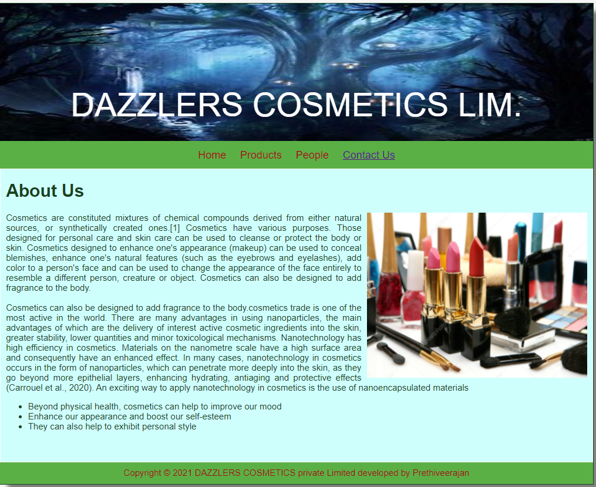
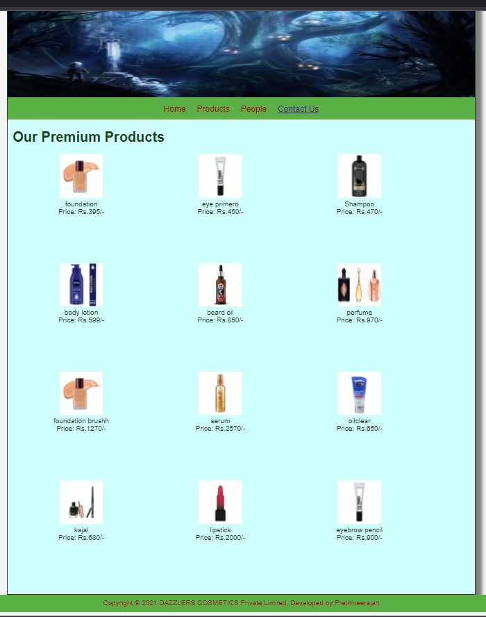
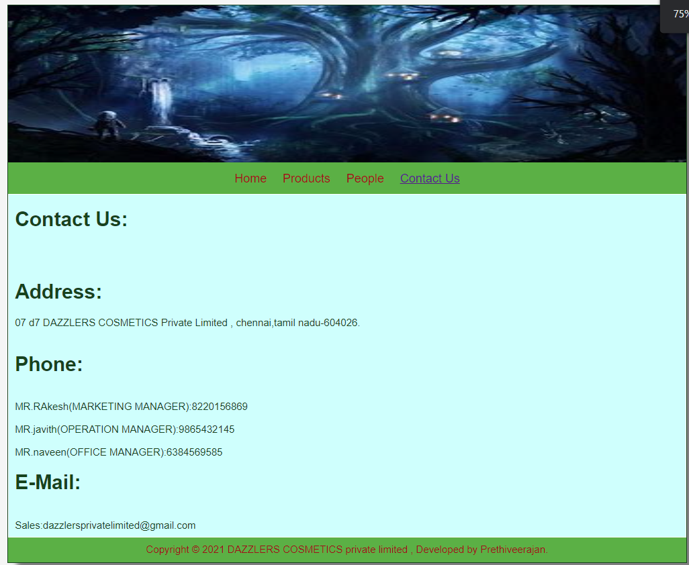

# Web Design for a Software Product Company

## AIM:

To design a static website for a software product company company.

## DESIGN STEPS:

### Step 1:

Requirement collection.

### Step 2:

Creating the layout using HTML and CSS.

### Step 3:

Updating the sample content.

### Step 4:

Choose the appropriate style and color scheme.

### Step 5:

Validate the layout in various browsers.

### Step 6:

Validate the HTML code.

### Step 6:

Publish the website in the given URL.

## PROGRAM :
LAYOUT CSS:
```
* {
  box-sizing: border-box;
  font-family: Arial, Helvetica, sans-serif;
}
body {
  background-color: whitesmoke;
  color: #17421d;
}
.container {
  width: 1080px;
  margin-left: auto;
  margin-right: auto;
  border-width: 1px 1px 1px 1px;
  border-style: solid;
  box-shadow: 15px 15px 8px gray;
}

.banner {
  display: block;
  width: 100%;
  height: 250px;
  text-align: center;
  font-size: 60px;
  background-image: url(/static/img/dark\ image.jpg);
  background-size: 100% 100%;
  margin: 0px 0px 0px 0px;
  padding-top: 150px;
  color: white;
}

.menu {
  display: block;
  width: 100%;
  height: 50px;
  font-size: larger;
  background-color: #5bb045;
  text-align: center;
  padding-top: 15px;
  margin: 0px 0px 0px 0px;
  border-width: 1px;
}

.menuitem {
  display: inline-block;
  margin-left: 10px;
  margin-right: 10px;
}
.menuitemselected {
  display: inline-block;
  margin-left: 10px;
  margin-right: 10px;
  color: #16d1ae;
}

.menuitem a {
  text-decoration: none;
  color: #9c1018;
}

.content {
  display: block;
  width: 100%;
  background-color: #cffffd;
  min-height: 500px;
  margin: 0px 0px 0px 0px;
  border-width: 1px;
  border-color: white;
  border-style: solid;
}
.homecontent {
  min-height: 500px;
  margin: 10px 10px 10px 10px;
}
.homecontent h1 {
  text-align: left;
}
.homecontent img {
  float: right;
  width: 400px;
  height: 300px;
  margin-left: 10px;
}

.contenttext {
  text-align: justify;
}

.productcontent {
  min-height: 500px;
  margin: 10px 10px 10px 10px;
}

.productcontent h1 {
  text-align: left;
}

.productitems {
  display: block;
}

.productitem {
  display: inline-block;
  width: 30%;
  height: 250px;
  text-align: center;
}

.productitem img {
  width: 100px;
  height: 100px;
  display: block;
}
.productitem .itemimage {
  display: block;
  margin-left: auto;
  margin-right: auto;
  width: 100px;
  margin-bottom: 5px;
}

.productitem .itemname {
  display: block;
}
.productitem .itemprice {
  display: block;
}

.footer {
  display: block;
  width: 100%;
  height: 40px;
  background-color: #5bb045;
  text-align: center;
  padding-top: 10px;
  margin: 0px 0px 0px 0px;
  color: #9c1018;
}
```
HOME PAGE:
```
<!DOCTYPE html>
<html lang="en">
  <head>
    <title> DAZZLERS COSMETICS private Limited </title>
    <link rel="stylesheet" href="./css/layout.css" />
    <link rel="icon" href="./img/icon.png" type="image/x-icon" />
  </head>

  <body>
    <div class="container">
      <div class="banner"> DAZZLERS COSMETICS  LIM.</div>
      <div class="menu">
        <div class="menuitem"><a href="/static/home.html">Home</a></div>
        <div class="menuitem"><a href="/static/products.html">Products</a></div>
        <div class="menuitem"><a href="/static/people.html">People</a></div>
        <div class="menuitemselected"><a href="/static/contactus.html">Contact Us</a></div>
        </div>
      <div class="content">
        <div class="homecontent">
          <h1>About Us</h1>
          
          <div class="contenttext">
            Cosmetics are constituted mixtures of chemical compounds derived from either natural sources, or synthetically created ones.[1] 
            Cosmetics have various purposes. Those designed for personal care and skin care can be used to cleanse or protect the body or skin.
             Cosmetics designed to enhance one's appearance (makeup) can be used to conceal blemishes, enhance one's natural features (such as the eyebrows and eyelashes),
              add color to a person's face and can be used to change the appearance of the face entirely to resemble a different person, creature or object.
               Cosmetics can also be designed to add fragrance to the body.
            <br><br>
            Cosmetics can also be designed to add fragrance to the body.cosmetics trade is one of the
            most active in the world. There are many advantages in using nanoparticles, the main 
            advantages of which are the delivery of interest active cosmetic ingredients into the
            skin, greater stability, lower quantities and minor toxicological mechanisms.
            Nanotechnology has high efficiency in cosmetics. Materials on the nanometre scale have
            a high surface area and consequently have an enhanced effect. In many cases,
            nanotechnology in cosmetics occurs in the form of nanoparticles, which can penetrate
            more deeply into the skin, as they go beyond more epithelial layers, enhancing
            hydrating, antiaging and protective effects (Carrouel et al., 2020). An exciting 
            way to apply nanotechnology in cosmetics is the use of nanoencapsulated materials
                  
            <ul>
              <li>Beyond physical health, cosmetics can help to improve our mood</li>
              <li>Enhance our appearance and boost our self-esteem</li>
              <li> They can also help to exhibit personal style </li>
            </ul>
          </div>
        </div>
      </div>
      <div class="footer">
        Copyright &#169; 2021 DAZZLERS COSMETICS private Limited developed by Prethiveerajan
      </div>
    </div>
  </body>
</html>
```
PRODUCT PAGE:
```
<!DOCTYPE html>
<html lang="en">
  <head>
    <title>DAZZLERS COSMETICS private Limited </title>
    <link rel="stylesheet" href="./css/layout.css" />
    <link rel="icon" href="./img/icon.png" type="image/x-icon" />
  </head>

  <body>
    <div class="container">
      <div class="banner"></div>
      <div class="menu">
        <div class="menuitem"><a href="/static/home.html">Home</a></div>
        <div class="menuitem"><a href="/static/products.html">Products</a></div>
        <div class="menuitem"><a href="/static/people.html">People</a></div>
        <div class="menuitemselected"><a href="/static/contactus.html">Contact Us</a></div>
        </div>
      <div class="content">
        <div class="productcontent">    
          <h1>Our Premium Products</h1>
          <div class="productitems">
              <div class="productitem"> 
                  <div class="itemimage">
                  
                  </div>
                  <div class="itemname">foundation</div>
                  <div class="itemprice">Price: Rs.395/- </div>
              </div>
              <div class="productitem"> 
                  <div class="itemimage">
                  
                  </div>
                  <div class="itemname">eye primero</div>
                  <div class="itemprice">Price: Rs.450/- </div>
              </div>
              <div class="productitem"> 
                <div class="itemimage">
                
                </div>
                <div class="itemname">Shampoo</div>
                <div class="itemprice">Price: Rs.470/- </div>
              </div>
              <div class="productitem"> 
                <div class="itemimage">
                
                </div>
                <div class="itemname">body lotion</div>
                <div class="itemprice">Price: Rs.599/- </div>
            </div>
            <div class="productitem"> 
              <div class="itemimage">
              
              </div>
              <div class="itemname">beard oil</div>
              <div class="itemprice">Price: Rs.850/- </div>
          </div>  <div class="productitem"> 
            <div class="itemimage">
            
            </div>
            <div class="itemname">perfume</div>
            <div class="itemprice">Price: Rs.970/- </div>
          </div>  <div class="productitem"> 
            <div class="itemimage">
            
            </div>
            <div class="itemname">foundation brushh</div>
            <div class="itemprice">Price: Rs.1270/- </div>
          </div>  <div class="productitem"> 
            <div class="itemimage">
            
            </div>
            <div class="itemname">serum</div>
            <div class="itemprice">Price: Rs.2570/- </div>
          </div>  <div class="productitem"> 
            <div class="itemimage">
            
            </div>
            <div class="itemname">oilclear</div>
            <div class="itemprice">Price: Rs.650/- </div>
        </div>
      </div>  <div class="productitem"> 
        <div class="itemimage">
        
        </div>
        <div class="itemname">kajal</div>
        <div class="itemprice">Price: Rs.680/- </div>
      </div>  <div class="productitem"> 
        <div class="itemimage">
        
        </div>
        <div class="itemname">lipstick</div>
        <div class="itemprice">Price: Rs.2000/- </div>
      </div>  <div class="productitem"> 
        <div class="itemimage">
        
        </div>
        <div class="itemname">eyebrow pencil</div>
        <div class="itemprice">Price: Rs.900/- </div>
            </div>
          </div>
          </div>        
      </div>
      <div class="footer">
        Copyright &#169; 2021 DAZZLERS COSMETICS Private Limited, Developed by Prethiveerajan
      </div>
    </div>
  </body>
</html>
```
PEOPLE PAGE:
```
<!DOCTYPE html>
<html lang="en">
  <head>
    <title>DAZZLERS COSMETICS private Limited </title>
    <link rel="stylesheet" href="./css/layout.css" />
    <link rel="icon" href="./img/ail.png" type="image/x-icon" />
    </head>
    <body>
    <div class="container">
      <div class="banner"></div>
      <div class="menu">
        <div class="menuitem"><a href="/static/home.html">Home</a></div>
        <div class="menuitem"><a href="/static/products.html">Products</a></div>
        <div class="menuitem"><a href="/static/people.html">People</a></div>
        <div class="menuitemselected"><a href="/static/contactus.html">Contact Us</a></div>
        </div>
      <div class="content">
        <div class="homecontent">
          <h1>Our company employees:</h1><br><br>
          <div class="productitems">
            <div class="productitem"> 
                <div class="itemimage">
                
                </div>
                <div class="itemname">Prethiveerajan</div>
                <div class="itemprice">DEAN</div>
            </div>
            <div class="productitem"> 
                <div class="itemimage">
                
                </div>
                <div class="itemname">krish</div>
                <div class="itemprice">Office manager</div>
            </div>
            <div class="productitem"> 
              <div class="itemimage">
              
              </div>
              <div class="itemname">JEEVA</div>
              <div class="itemprice">Assistant HR</div>
            </div>
            <div class="productitem"> 
              <div class="itemimage">
              
              </div>
              <div class="itemname">jega</div>
              <div class="itemprice">Marketing Manager</div>
          </div>
          <div class="productitem"> 
            <div class="itemimage">
            
            </div>
            <div class="itemname">HARISH</div>
            <div class="itemprice">Professional Staff</div>
        </div>  <div class="productitem"> 
          <div class="itemimage">
          
          </div>
          <div class="itemname">saran</div>
          <div class="itemprice">Operation Manager</div>
      </div>
          </div>
        </div>
        </div>        
    </div>
    <div class="footer">
      Copyright &#169; 2021 DAZZLERS COSMETICS Private Limited, Developed by Prethiveerajan.
    </div>
  </div>
</body>
</html>
```
CONTACTUS PAGE:
```
<!DOCTYPE html>
<html lang="en">
  <head>
    <title>DAZZLERS cosmetics Private Limited</title>
    <link rel="stylesheet" href="./css/layout.css" />
    <link rel="icon" href="./img/ail.png" type="image/x-icon" />
  </head>

  <body>
    <div class="container">
      <div class="banner"></div>
      <div class="menu">
        <div class="menuitem"><a href="/static/home.html">Home</a></div>
        <div class="menuitem"><a href="/static/products.html">Products</a></div>
        <div class="menuitem"><a href="/static/people.html">People</a></div>
        <div class="menuitemselected"><a href="/static/contactus.html">Contact Us</a></div>
      </div>
      <div class="content">
        <div class="homecontent">
          <h1>Contact Us:</h1><br><br>
          <h1>Address:</h1>
          <div class="contenttext">
            07 d7 DAZZLERS COSMETICS Private Limited , chennai,tamil nadu-604026.
          </div><br>
          <h1>Phone:</h1><br>
          <div class="contenttext">
              MR.RAkesh(MARKETING MANAGER):8220156869<br><br>
              MR.javith(OPERATION MANAGER):9865432145<br><br>
              MR.naveen(OFFICE MANAGER):6384569585
          </div>
          <h1>E-Mail:</h1><br>
          <div class="contenttext">
              Sales:dazzlersprivatelimited@gmail.com
          </div>
        </div>
      </div>
      <div class="footer">
       Copyright &#169; 2021 DAZZLERS COSMETICS private limited , Developed by Prethiveerajan.
      </div>
    </div>
  </body>
</html>
```

## OUTPUT:

### Home Page:






## Result:

Thus a website is designed for the software product company and the HTML,CSS code are validated.
